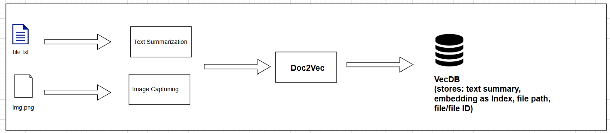
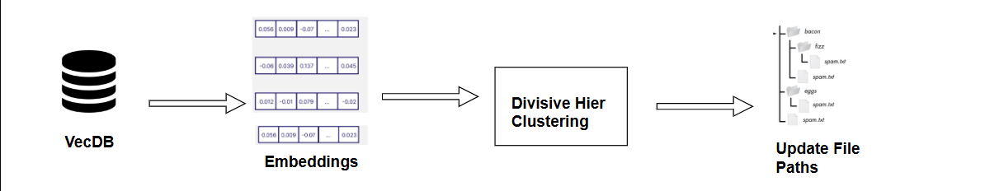

# AI-Powered Semantic File System

This repository implements a semantic file system that automatically captions images, summarizes text files, generates vector embeddings, and organizes files into semantically coherent “folders.” It also supports semantic search, dynamic re-structuring via clustering and keyword-based folder names, and a question-answering interface. A FastAPI server exposes endpoints for all major functions.

---

## Table of Contents

1. [Overview](#overview)  
2. [Features & Pipeline](#features--pipeline)  
   1. [1. Add New File / Bulk-Add](#1-add-new-file--bulk-add)  
   2. [2. Semantic Search](#2-semantic-search)  
   3. [3. File System Restructure](#3-file-system-restructure)  
   4. [4. Question Answering](#4-question-answering)  
   5. [5. FastAPI Server](#5-fastapi-server)  
3. [Demo & File Structure](#demo--file-structure)  
4. [Installation & Usage](#installation--usage)  
5. [Testing](#testing)  
6. [License](#license)

---

## Overview

The AI-Powered Semantic File System ingests images and text files, converts them into semantic embeddings, and stores them in a vector database.  
- **Images** are passed through a BLIP-based captioning model, then encoded into embedding space.  
- **Text files** are summarized with a pre-trained transformer and encoded into embedding space.  
- All embeddings are persisted in FAISS (via `vectorDB/file_index.faiss` and `index_metadata.json`).  

Once embeddings exist for every file in the system, you can:  
1. Perform **semantic search** to retrieve files by meaning rather than filename.  
2. **Restructure** the on-disk file hierarchy by clustering embeddings, assigning descriptive keywords to clusters, and moving files into new “folders” based on semantic similarity.  
3. Ask **questions** (e.g., “What files discuss statistical testing?”) and receive context-aware answers drawn from the indexed content.  
4. Run a **FastAPI** service (`src/server.py`) to expose all functionality via HTTP.

---

## Features & Pipeline

### 1. Add New File / Bulk-Add
- **Function**: `src/file_pipeline.py::add_file_pipeline()`  
- **Behavior**:  
  1. Detect file type by extension (`.jpg/.png` for images, `.txt/.md/.csv` for text).  
  2. If image: load with PIL, generate a caption via BLIP, then compute a sentence embedding (e.g., Sentence-BERT or OpenAI embeddings).  
  3. If text: read raw text, generate a summary via a transformer summarizer (e.g., BART/T5), then compute its embedding.  
  4. Write a new entry into `files_DB/` (e.g., `football_3495d2eb.png`) and index the embedding in FAISS.  

- **Bulk-Add**: call `add_all_in_directory(path)` (in `file_pipeline.py`) to process every file in a folder.  

### 2. Semantic Search
- **Function**: `src/get_relevant_files.py::search_files()`  

- **Behavior**:  
  1. Client provides a natural language query (image or text).  
  2. Query is embedded in the same embedding space.  
  3. FAISS is queried for the top-k nearest neighbors (cosine similarity).  
  4. Returns a ranked list of matching file IDs, along with file paths and caption/summary snippets.  

### 3. File System Restructure
- **Function**: `src/file_system_restructure.py::restructure_files()`  

- **Behavior**:  
  1. Loads all stored embeddings from `vectorDB/file_index.faiss`.  
  2. **Preprocessing**:  
     - L2-normalize each embedding.  
     - (Optional) Reduce dimensions (e.g., PCA or UMAP) for speed and noise reduction.  
  3. **Clustering**:  
     - By default, uses AgglomerativeClustering (cosine affinity, “average” linkage).  
     - Optionally can run K-Means or HDBSCAN on reduced embeddings.  
     - Produces a cluster label for each file.  
  4. **Keyword Extraction**:  
     - For each cluster, aggregate captions/summaries and run a keyword-extraction model (e.g., Sentence-BERT-based ranker) to pick a 1–2 word folder name (e.g., “soccer,” “statistical,” “swimming”).  
  5. **Rebuild On-Disk Hierarchy**:  
     - Create a new directory tree under `File_System_Restructured/` based on cluster-labels and keywords.  
     - Move or copy each file into its corresponding cluster folder.  

### 4. Question Answering
- **Function**: `src/get_relevant_files.py::answer_question()`  
- **Behavior**:  
  1. Accepts a free-form question (e.g., “Which files mention statistical testing methods?”).  
  2. Embeds the question in the shared vector space.  
  3. Retrieves top-k relevant files via FAISS.  
  4. Uses a RAG (Retrieval-Augmented Generation) approach to combine context from retrieved file captions/summaries and generate a concise, grounded answer.  

---

## Demo & File Structure

A sample simulation tree is provided under `File_System_Simulation/`. After running restructure, you can compare with `File_System_Restructured/`, which shows how files were regrouped by semantic clusters and renamed by keywords.

```
AI-Powered-File-System/
├── Dockerfile
├── Makefile
├── README.md
├── LICENSE
├── File\_System\_Simulation/
│   ├── dir1/
│   │   ├── football.png
│   │   ├── football.txt
│   │   └── statistical\_testing.txt
│   ├── dir2/
│   │   ├── math.txt
│   │   └── sea.png
│   └── swimming.txt
├── File\_System\_Restructured/
│   ├── soccer/
│   │   ├── football.png
│   │   └── football.txt
│   ├── statistical/
│   │   ├── math.txt
│   │   └── statistical\_testing.txt
│   └── swimming/
│       ├── sea.png
│       └── swimming.txt
├── files\_DB/                    ← raw files renamed with UUID suffixes
│   ├── football\_3495d2eb.png
│   ├── football\_121b4c9f.txt
│   ├── math\_621e6b1f.txt
│   ├── sea\_13bd8c9b.png
│   ├── statistical\_testing\_f17bd31b.txt
│   └── swimming\_7d550e69.txt
├── vectorDB/
│   ├── file\_index.faiss         ← FAISS index of all file embeddings
│   └── index\_metadata.json      ← Maps FAISS IDs → file IDs & metadata
├── models/                      ← Pre-downloaded Hugging Face models
│   ├── img\_caption/             ← BLIP image captioning
│   ├── summarizer/              ← BART/T5 summarization
│   ├── embedding/               ← Sentence-Transformer
│   └── kword\_extraction/        ← Keyword extraction model
├── src/                         ← Python source code
│   ├── file\_pipeline.py         ← “Add file” pipeline (caption/summary → embedding → store)
│   ├── vec\_db\_utils.py          ← FAISS index utilities (add, search, metadata)
│   ├── file\_system\_restructure.py← Clustering & folder reorganization
│   ├── get\_relevant\_files.py     ← Semantic search & QA routines
│   └── server.py                ← FastAPI entrypoint
├── notebooks/                   ← Example Jupyter notebooks (pipeline demos)
│   ├── img\_captioning.ipynb
│   ├── summarization.ipynb
│   ├── Clustering.ipynb
│   ├── FAISS.ipynb
│   ├── CLIP.ipynb
│   └── file\_adding\_pipeline.ipynb
├── tests/                       ← Unit tests (e.g. `test_data.py`)
├── pyproject.toml               ← Poetry config (dependencies, scripts)
└── Makefile                     ← Convenience tasks (build, lint, test, docker)
```

